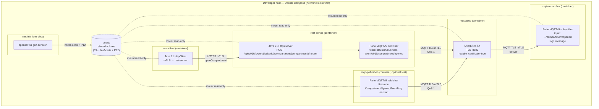
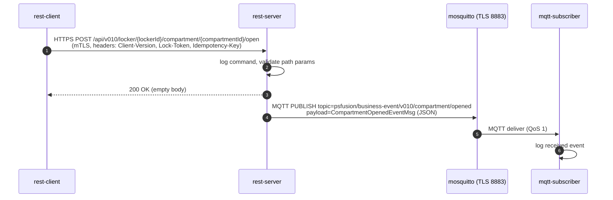

# locker-poc

Minimal **Java 21** Proof-of-Concept demonstrating secure, framework-free communication between a REST client, a REST server, and an MQTT publish/subscribe pair — all running as Docker containers orchestrated via Docker Compose, secured with self-signed mTLS certificates.

## Goals

- Show an end-to-end, secure flow:
  **REST Client → (HTTPS/mTLS) → REST Server → (MQTT/TLS) → MQTT Broker → MQTT Subscriber**
- Implement **only the `openCompartment` operation** from `DeliveryMachineBusinessFunction.Open-API-en.yaml`.
- Emit **only the `CompartmentOpenedEventMsg`** from `DeliveryMachineBusinessEvent.Open-API-en.yaml`.
- Use **pure JDK 21** (`HttpsServer`, `HttpClient`, `SSLContext`) plus the smallest possible set of libraries: **Eclipse Paho MQTTv5** + **Jackson**.
- **No application frameworks** (no Spring, no Quarkus, no Micronaut, no Jakarta EE).
- Everything buildable and runnable with `docker compose up` on Unix.

## Non-goals

- Not production-grade. Self-signed certs, hard-coded IDs, dummy business logic.
- No persistence, no auth beyond mTLS, no real locker hardware integration.
- No full OpenAPI surface — exactly **one** REST operation and **one** MQTT event.

---

## Stack (locked choices)

| Concern            | Choice                                                     |
| ------------------ | ---------------------------------------------------------- |
| Language / runtime | Java 21 (Temurin JRE in runtime images)                    |
| Build              | Maven multi-module                                         |
| HTTPS server       | JDK `com.sun.net.httpserver.HttpsServer`                   |
| HTTPS client       | JDK `java.net.http.HttpClient`                             |
| MQTT client        | Eclipse Paho **MQTTv5** (`org.eclipse.paho.mqttv5.client`) |
| MQTT broker        | Eclipse Mosquitto 2.x                                      |
| JSON               | Jackson `jackson-databind`                                 |
| Logging            | `java.util.logging` (JUL) + `logging.properties`           |
| TLS trust model    | **mTLS everywhere**, one self-signed CA signs all certs    |
| Cert generation    | `openssl` via `scripts/gen-certs.sh` (one-shot init)       |
| Orchestration      | Docker Compose (Unix)                                      |

---

## Repository layout

```text
locker-poc/
├── docker-compose.yml
├── README.md
├── SPEC.md
├── .gitignore
├── certs/                              # generated at build time, git-ignored
│   ├── ca.crt                          # self-signed root CA
│   ├── broker.{crt,key}                # mosquitto server cert
│   ├── rest-server.{crt,key}           # HTTPS server cert
│   ├── rest-client.{crt,key}           # HTTPS client cert
│   ├── mqtt-publisher.{crt,key}
│   ├── mqtt-subscriber.{crt,key}
│   ├── truststore.p12                  # contains ca.crt (Java)
│   └── *-keystore.p12                  # per-service key+cert bundle (Java)
├── scripts/
│   └── gen-certs.sh                    # openssl: creates CA + leaf certs + PKCS#12 stores
├── mosquitto/
│   ├── Dockerfile
│   └── mosquitto.conf                  # 8883 TLS, require_certificate true
├── parent-pom/
│   └── pom.xml                         # shared dependency versions + Java 21
├── common/                             # shared DTOs & TLS helpers
│   ├── pom.xml
│   └── src/main/java/com/example/locker/common/
│       ├── dto/OpenCompartmentCommand.java
│       ├── dto/CompartmentOpenedEventMsg.java
│       ├── dto/EventHeaders.java
│       ├── dto/ErrorResponseTo.java
│       └── tls/TlsContextFactory.java
├── rest-server/                        # HTTPS server + MQTT publisher
│   ├── Dockerfile
│   ├── pom.xml
│   └── src/main/java/com/example/locker/server/
│       ├── RestServerMain.java
│       ├── OpenCompartmentHandler.java
│       └── MqttEventEmitter.java
├── rest-client/                        # sends openCompartment over HTTPS
│   ├── Dockerfile
│   ├── pom.xml
│   └── src/main/java/com/example/locker/client/RestClientMain.java
├── mqtt-publisher/                     # standalone test publisher
│   ├── Dockerfile
│   ├── pom.xml
│   └── src/main/java/com/example/locker/mqtt/PublisherMain.java
├── mqtt-subscriber/                    # listens on compartment/opened topic
│   ├── Dockerfile
│   ├── pom.xml
│   └── src/main/java/com/example/locker/mqtt/SubscriberMain.java
├── integration-test/                   # JUnit 5 end-to-end test driving docker compose
│   ├── pom.xml
│   └── src/test/java/com/example/locker/it/
│       ├── DockerComposeStack.java
│       ├── CertLoader.java
│       ├── MqttTestClient.java
│       └── EndToEndIT.java
└── pom.xml                             # aggregator
```

---

## System diagram



### End-to-end happy path



---

## Quick start (after implementation)

> These commands are the **target** flow defined by the SPEC. No files exist yet.

```bash
# 1. Generate self-signed CA + leaf certs (idempotent)
./scripts/gen-certs.sh

# 2. Build all Java modules and Docker images
docker compose build

# 3. Start broker + server + subscriber; run client once
docker compose up

# 4. Observe logs
docker compose logs -f rest-server mqtt-subscriber

# 5. Run the end-to-end integration test (spins the stack up/down itself)
mvn -pl integration-test -am verify
```

### Healthchecks

Every long-running container (`mosquitto`, `rest-server`, `mqtt-subscriber`) exposes a Docker `HEALTHCHECK` and every one-shot container (`rest-client`, `mqtt-publisher`) reports completion via a sentinel file. See **SPEC §6.5** for the exact commands. `depends_on` uses `condition: service_healthy` / `service_completed_successfully` so the compose graph is race-free.

### Integration test

Module `integration-test/` (JUnit 5, test scope only — no framework in production code) boots the full stack via `docker compose`, waits for all healthchecks, runs black-box checks over HTTPS + MQTT using the generated certificates, then tears the stack down. See **SPEC §10**.

---

## Documentation

- [`SPEC.md`](./SPEC.md) — full technical specification (architecture, message contracts, TLS details, container/port matrix, build/run, acceptance criteria).
- `DeliveryMachineBusinessFunction.Open-API-en.yaml` — source of the `openCompartment` REST contract.
- `DeliveryMachineBusinessEvent.Open-API-en.yaml` — source of the `CompartmentOpenedEventMsg` event contract.

---

## Security disclaimer

This repository is a **proof of concept**. Certificates are self-signed, private keys are stored in a local volume, IDs are hard-coded, and there is no secret management. **Do not reuse any of this in production.**
